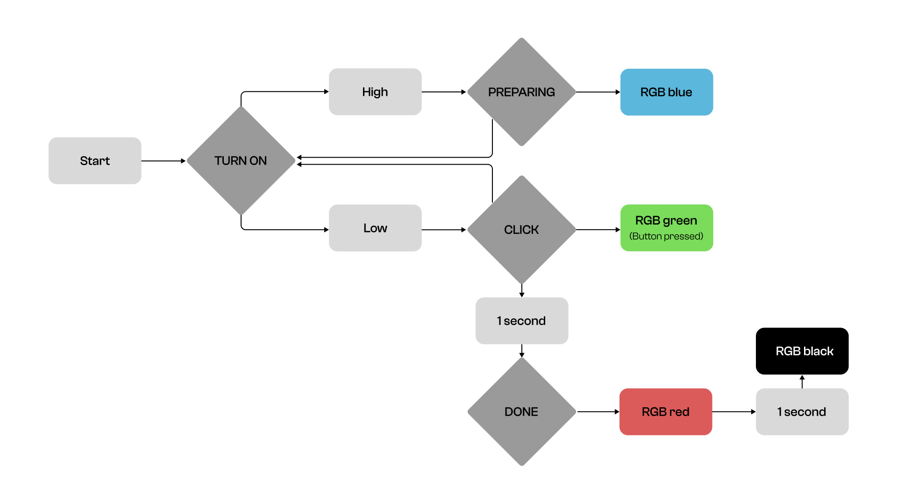

## assignment 1
Assignment 1 description

#Introduction

I made a project inspired by classic camera flashing. When people use the classic camera, the flash will blink one time when they took the picture. By that, using lego camera, I bring similar functions to my first project.

[Repository README link](../README.md)  
[This README link](README.md)  

#Firmware
```
 # When user took the picture, light will blink time like camrea flash.

   elif program_state == 'DONE':
    
    for i in range(100):
      rgb_color = get_rgb_color(i, 100-i, 0)
      rgb.fill_color(rgb_color)
      output_pin.on()
      time.sleep_ms(2)
      
    time.sleep(1)
    
    for i in range(100):
      rgb_color = get_rgb_color(100-i, 0, 0)
      rgb.fill_color(rgb_color)
      time.sleep_ms(1)
      
      
    rgb.fill_color(0)
    output_pin.off()
```
#State Diagram

blakskkskksksksskskkss:


#Physical Components

Using LEGO kits, I built the classic camera and used coppers, light, resistor to make function.

#Project Outcome


Video
* item1
* item2
* item3

