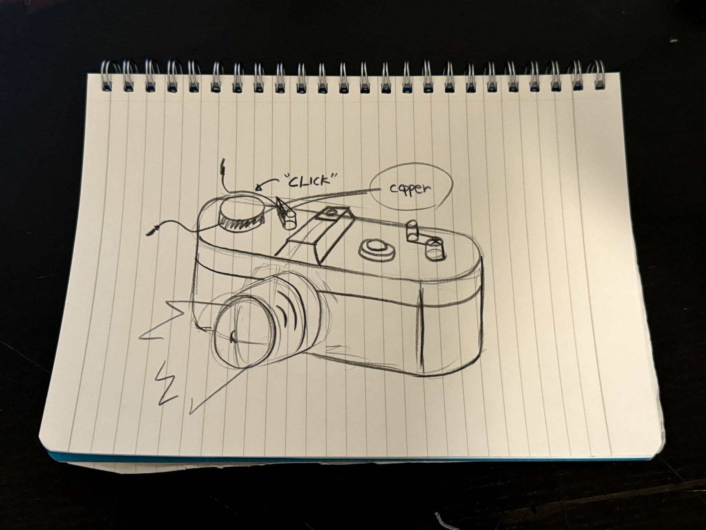
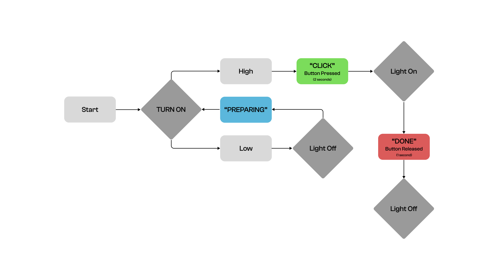

# Introduction

"CLASSIC CAMERA"

I sketched an ideation inspired by classic cameras. In traditional cameras, the flash blinks once when a picture is taken. Based on this, I incorporated a similar function into my first project using a Lego camera.



# Hardware

* Copper(INPUT)
* One light(OUTPUT)
* One resistor
* Four wires

# Firmware
```
 # When the user takes a picture(INPUT), the light will blink once(OUTPUT), like a camera flash.

   elif program_state == 'DONE':
    
    for i in range(100):
      rgb_color = get_rgb_color(i, 100-i, 0)
      rgb.fill_color(rgb_color)
      output_pin.on()
      time.sleep_ms(2)
      
    time.sleep(1)
    
    for i in range(100):
      rgb_color = get_rgb_color(100-i, 0, 0)
      rgb.fill_color(rgb_color)
      time.sleep_ms(1)
      
      
    rgb.fill_color(0)
    output_pin.off()
```
# State Diagram

When the program is turned on, it enters a preparation mode (RGB Blue). When the user clicks and holds the camera handle for 2 seconds (RGB Green), the light will turn on (RGB Red). After 1 second, the light will turn off, and the program will close.



# Physical Components

Using LEGO kits, I built a classic camera and incorporated copper wires, lights, and resistors to create its functionality.

# Project Outcome

It was pretty fun to start this project from the beginning. I aimed to turn the light on when the user takes a picture and turn it off when the user finishes. This function helps the user recognize whether the picture was successfully taken.


# Video
https://drive.google.com/drive/folders/1HGnTw7oHCrzTg4h89gobelJjIQi-6_kc?usp=sharing
