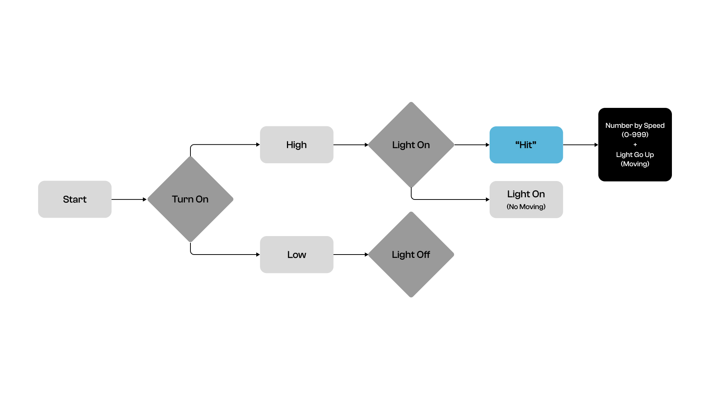
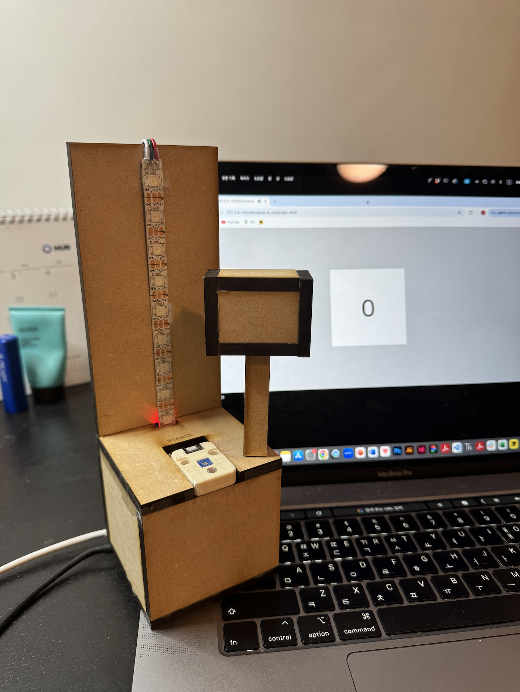

# Introduction

"HAMMER PUNCH GAME MACHINE"

I sketched an idea inspired by a hammer punch game machine. Similar to how the score is determined by the force when people play the hammer punch game, this idea displays the score based on the speed of play.


# Hardware

* ESP32
* Atom Board (Connecter)
* Analog Light Sensor(INPUT)
* RGB LED Lighting (OUTPUT)

# Software

* Visual Studio Code


# Firmware
```
 # When the user hits the analog light sensor with a hammer (INPUT), the RGB light will go up, and a number will be displayed based on the speed (OUTPUT).
    if (light_val > max_val):
        
        if (program_state == 'running'):
            
            time_difference = time.ticks_ms() - sensor_timer
            time_difference = 1000 - time_difference
        
            if time_difference < 0:
                time_difference = 0
           
            program_state = 'finished'
            print(time_difference)
            
    elif (light_val < min_val):
      
        sensor_timer = time.ticks_ms() 
        program_state = 'running'
```
# State Diagram

When the program is turned on, the RGB LED light will turn on. When the user hits the analog light sensor with a hammer, the RGB light will go up, and a number will be displayed based on the speed.



# Physical Components

Using the MDF materials, I built a Hammer Punch Game Machine and incorporated an ESP32, Atom Board, Analog Light Sensor, and RGB LED Lighting to create its functionality.

# Project Outcome

This project was exciting because I got to learn new coding skills, design, and build my own game machine. The kit was fun for users to play, with different numeric outcomes each time based on speed. Mixing Visual Studio Code software with hardware made for a unique learning experience!



# Video
https://drive.google.com/file/d/14mjHQ9SXNlSNz6hUL8Yeqzj76L-96leI/view?usp=sharing


