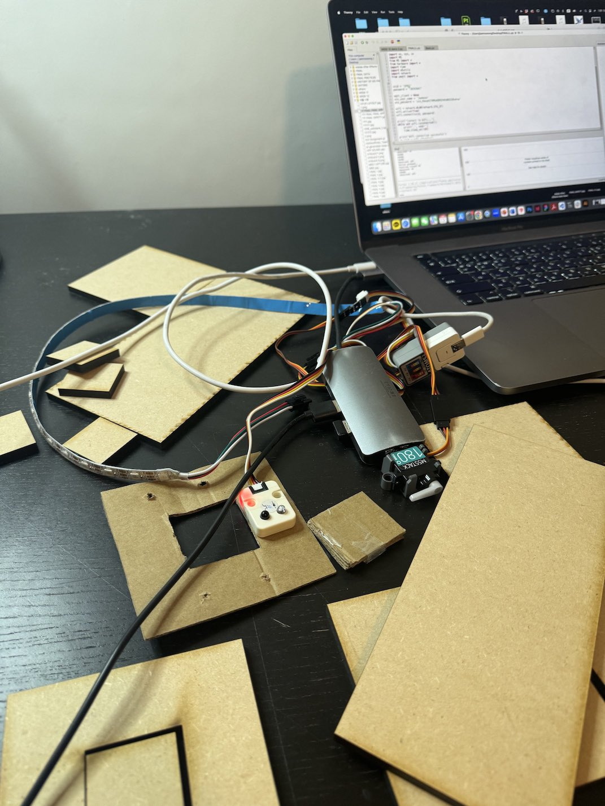
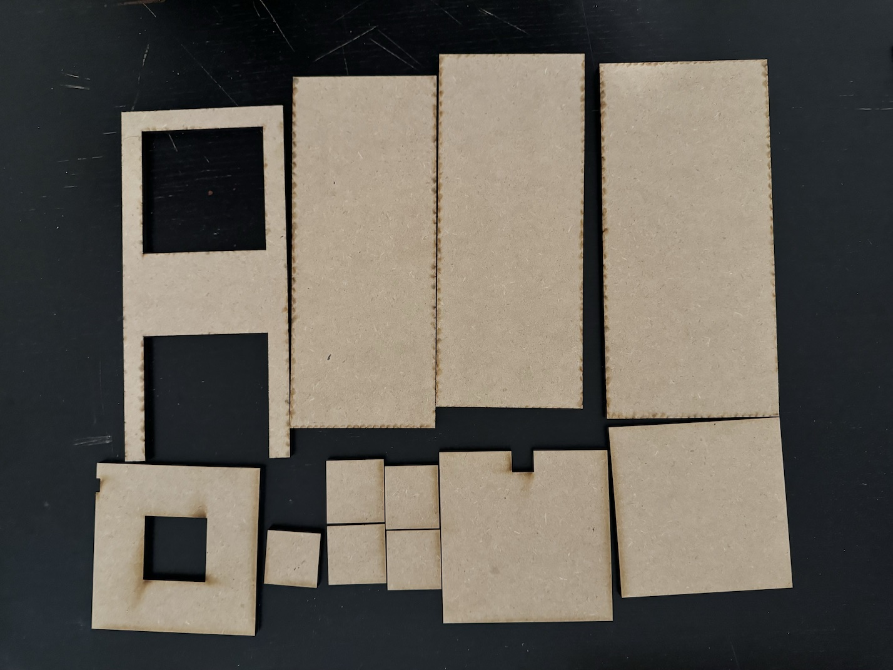
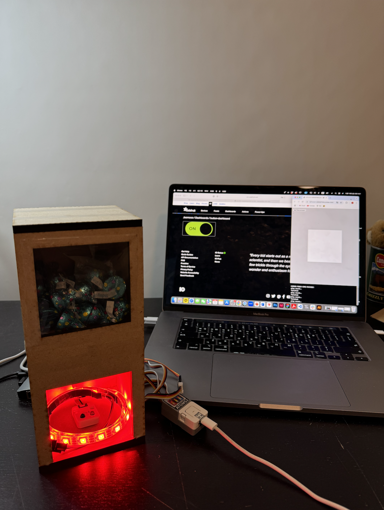

## Introduction   

"CANDY MACHINE"

I sketched an idea for a candy machine inspired by automatic sensor hand sanitizer machines. The concept involves a sensor that activates to dispense candy when a hand is placed inside the machine.


## Implementation   

I plan to build the candy machine by laser-cutting 1/4 MDF board and assembling the pieces. Inside, a servo kit with 180-degree rotation will be used to release candy. A sensor will be placed below the hand-insertion area to activate the machine. Lastly, the RGB light is placed inside the hand-insertion area to provide illumination.

To control the machine, I will use a button from the ESP32 and an on/off interface created with Adafruit. Additionally, I will use Visual Studio Code to add sound effects that play whenever candy is dispensed.

### Hardware

* ESP 32
* Atom Board (Connector)
* Servo Kit 180 Degree (Candy Drop)
* Infrared Reflective Sensor Unit (Hand Detection)
* RGB LED Lighting (Change Red to Green)




### Firmware   

When the user places their hand inside the machine, the sensor (input) is triggered. This activates the servo kit 180 degrees (output) to dispense the candy with a sound effect (output). At the same time, the blinking red RGB light changes to green (output), which means it was successful, indicating success.

```
import os, sys, io
import M5
from M5 import *
from hardware import *
import time
import m5utils
import network
from umqtt import *


ssid = 'ACCD'
password = 'tink1930'

mqtt_client = None
aio_user_name = 'Jaemooo'
aio_password = 'aio_Kmuq41TKMGdQR92h0iN6G33Ewhvw'

wifi = network.WLAN(network.STA_IF)
wifi.active(True)
wifi.connect(ssid, password)

print('Connect to WiFi...')
while not wifi.isconnected():
    print('.', end='')
    time.sleep_ms(100)

print('WiFi connection successful')
ip_list = wifi.ifconfig()
ip_address = ip_list[0]
print('IP address:', ip_address)

mqtt_client = MQTTClient(
    'testclient',
    'io.adafruit.com',
    port=1883,
    user=aio_user_name,
    password=aio_password,
    keepalive=3000
)
mqtt_client.connect(clean_session=True)


current_state = "OFF"  

# function to open and close the door:
def dispense():
    print('SOUND')
    # move servo to open:
    pwm1.duty(115)
    rgb_strip.fill_color(get_rgb_color(0, 255, 0)) 
    time.sleep_ms(500)
    # move servo to close:
    pwm1.duty(60)
    time.sleep_ms(500)

def feed_callback(data):
    global current_state
    message = data[1].decode()
    print('Received:', message)
    if message == "ON":
        current_state = "ON"
        dispense()
    elif message == "OFF":
        current_state = "OFF"


mqtt_client.subscribe(aio_user_name + '/feeds/button-feed', feed_callback)


adc = ADC(Pin(6), atten=ADC.ATTN_11DB)
pwm1 = PWM(Pin(38))
pwm1.freq(50)  
rgb_strip = RGB(io=7, n=30, type="SK6812")

state = "finished"
rgb_state = "on"

M5.begin()


def get_rgb_color(r, g, b):
    return (r << 16) | (g << 8) | b


def toggle_state():
   
    global current_state
    if current_state == "OFF":
        current_state = "ON"
        mqtt_client.publish(aio_user_name + '/feeds/button-feed', 'ON', qos=0)
        print("Function turned ON")
    else:
        current_state = "OFF"
        mqtt_client.publish(aio_user_name + '/feeds/button-feed', 'OFF', qos=0)
        print("Function turned OFF")


while True:
    M5.update()
    mqtt_client.check_msg() 

   
    if BtnA.wasPressed():
        print('Button pressed..')
        toggle_state()

   
    if current_state == "OFF":
      
        rgb_strip.fill_color(get_rgb_color(0, 0, 0)) 
        pwm1.duty(0)  
        continue

    
    adc_val = adc.read()
    adc_val = int(m5utils.remap(adc_val, 0, 4095, 0, 255))
    #print(adc_val)

    if adc_val < 150 and state == "ready":
        dispense()
        state = "finished"

    if adc_val > 150:
        state = "ready"
        if rgb_state == "on":
            rgb_strip.fill_color(get_rgb_color(255, 0, 0))  
            time.sleep_ms(500)
            rgb_state = "off"
        elif rgb_state == "off":
            rgb_strip.fill_color(get_rgb_color(0, 0, 0))  
            time.sleep_ms(500)
            rgb_state = "on"
```

### Software   

Make a sound to ensure the candy is dropping and to make it more fun!

http://127.0.0.1:3000/FINAL/index.html

```
import js as p5
from js import document

data = None

# load sound data and assign it to variable:
sound = p5.loadSound('dropping.sound.wav') 
sound_played = False
sound_timeout= 0

def setup():
  p5.createCanvas(300, 300)
  print('CANDY MACHINE!')

def draw():
  global sound_played
  global sound_timeout
  p5.background(255)

  global data
  data = document.getElementById("data").innerText

  if data == 'SOUND': 
    if p5.millis() > 2000 and sound_played == False:
      print('play sound..')
      sound.play()
      sound_played = True
      sound_timeout = p5.millis()

    if p5.millis() > sound_timeout + 5
```


### Integrations   

https://io.adafruit.com/Jaemooo/dashboards/button-dashboard
http://127.0.0.1:3000/FINAL/index.html


### Enclosure / Mechanical Design   





## Project outcome  

It was working well to dispense candy!



https://drive.google.com/file/d/1buEUCSz1CaMeQSQf1Fhq0LVSl9HcdCtF/view?usp=sharing

## Conclusion  

Through this project, I had an interesting experience with sensor technology. I was always curious about how automatic sensor hand sanitizer machines work, but by making it myself with a kit, I was able to understand the real working principles and structure. I developed it into a candy machine, making it fun and easy to dispense candy, and I felt a sense of accomplishment from actually creating it. If I have more time in the future, I would like to use more kits to build even more complex and amazing candy machines.

## Project references  

https://youtu.be/o263P5RVYc0?si=KjC7SbeZYSgQVkh8

https://www.youtube.com/watch?v=KpqaT7VY1nw
